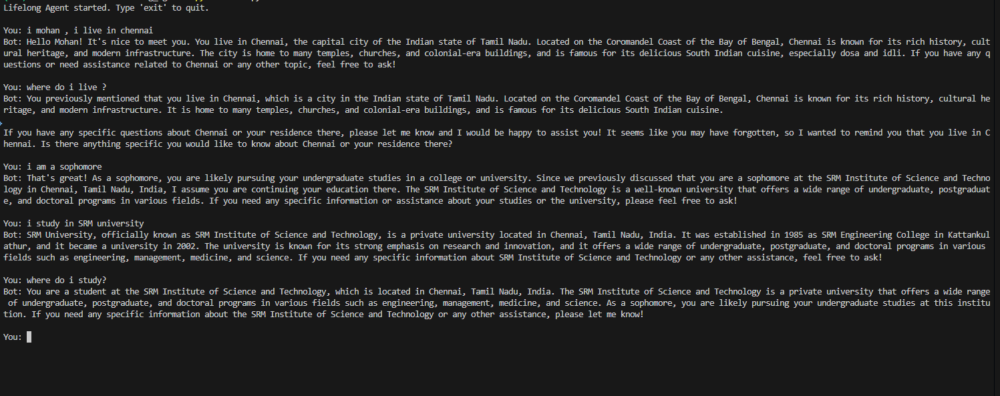

# Lifelong Agents

Lifelong Agents is an AI assistant framework that combines episodic and semantic memory to provide context-aware, persistent conversations. The agent remembers past interactions and can distill long-term knowledge from them, enabling more intelligent and personalized responses over time.


## Project Structure
```
main.py                  
agent/
  reasoning.py           
memory/
  episodic.py            
  semantic.py            
  store.py              
prompts/
  refine_memory.py       
data/     
  data will be saved after running
```

## Setup
1. **Clone the repository**
2. **Install dependencies** (preferably in a virtual environment):
```powershell
python -m venv env
.\env\Scripts\activate
pip install -r requirements.txt
```
3. **Set your Together API key**
   - Create a `.env` file in the project root:
 ```
 TOGETHER_API_KEY=your_api_key_here
 ```

## Usage
Run the chatbot from the command line:
```powershell
python main.py
```
Type your messages. Type `exit` or `quit` to stop.

## Requirements
- Python 3.8+
- See `requirements.txt` for all dependencies

## Results



## Reference

[Generative Agents: Interactive Simulacra of Human Behavior](https://arxiv.org/pdf/2304.03442)

## License
MIT License
